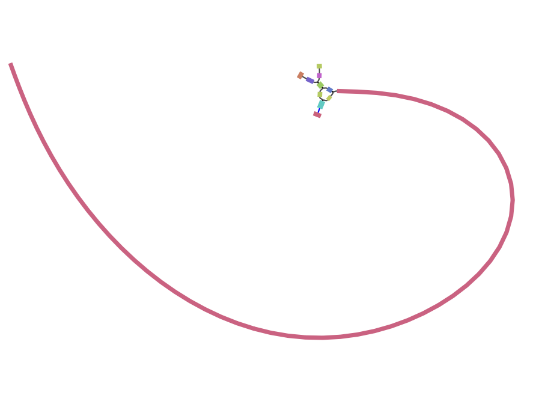
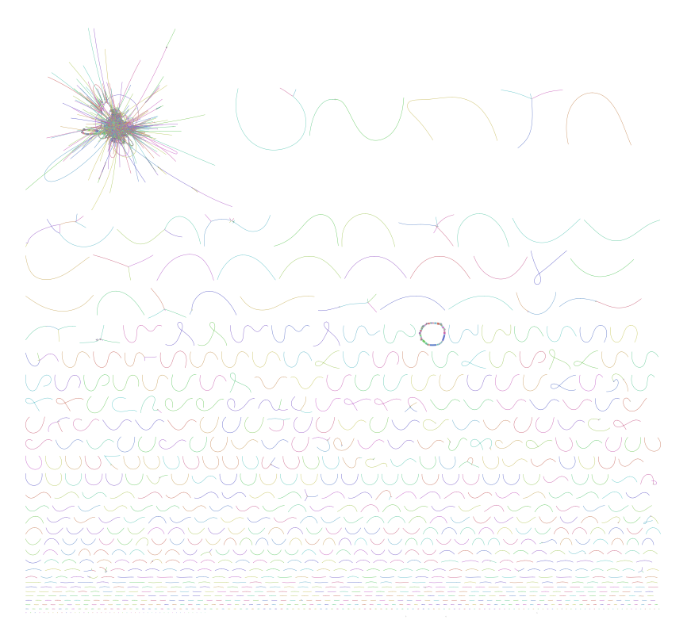

# MyGenome

Quality control, trimming, de novo genome assembly, gene prediction, and genome annotation of paired-end Illumina reads for *Pyricularia pennisetigena* Pp371.

---

## Table of Contents

1. Project Overview  
2. Raw Data Acquisition  
3. Assess Sequence Quality  
4. Sequence Trimming  
5. Post-Trim Quality Assessment  
6. Genome Assembly Strategy  
7. K-mer Selection and Optimization  
8. Velvet Assembly (Round 1)  
9. Velvet Assembly (Round 2 Optimization)  
10. SPAdes Assembly  
11. Assembly Metrics Comparison  
12. Read and Assembly Statistics  
13. Assembly Graph Visualization (Bandage)  
14. Directory Structure  
15. SNAP HMM Training  
16. Gene Prediction Strategy  
17. Gene Prediction with SNAP  
18. Gene Prediction with AUGUSTUS  
19. Gene Prediction Summary  
20. Genome Annotation with MAKER  
21. MAKER Gene Prediction Summary  
22. IGV Gene Model Comparisons  
23. BLAST Analysis  
24. Final Notes  

---

## Project Overview

This repository documents an end-to-end bioinformatics workflow for *Pyricularia pennisetigena* strain Pp371, including sequence quality assessment, read trimming, de novo genome assembly, gene prediction, genome annotation, and visualization. The goal is to generate a high-quality genome assembly and produce biologically meaningful gene models using multiple complementary tools. Assembly quality was evaluated using standard metrics (genome size, contig count, N50, and graph structure), and gene predictions were generated using SNAP, AUGUSTUS, and MAKER, with results visualized in IGV.

---

## Raw Data Acquisition

Raw sequencing data for *Pp371* was obtained from the course dataset.

---

## Assess Sequence Quality
Initial quality assessment revealed multiple issues in the raw sequencing data, including adapter contamination and base composition bias. These issues were expected in raw Illumina reads and required correction prior to assembly to avoid introducing errors into downstream analyses.

Raw paired-end reads were evaluated using FastQC prior to trimming. All warning (orange) and error (red) flags are summarized below.

---

<details>
<summary><strong>Pp371_1.fq.gz (Raw Forward Reads)</strong></summary>


Pp371_1.fq.gz


**Warning (Orange) Flags**
- Per tile sequence quality  
- Per base sequence content  
- Per sequence GC content  

**Error (Red) Flags**
- Overrepresented sequences  
- Adapter Content  

### Summary Tab


### Adapter Content Tab


</details>

---

<details>
<summary><strong>Pp371_2.fq.gz (Raw Reverse Reads)</strong></summary>


Pp371_2.fq.gz


**Warning (Orange) Flags**
- Per tile sequence quality  
- Per sequence GC content  
- Overrepresented sequences  

**Error (Red) Flags**
- Per base sequence content  
- Adapter Content  

### Summary Tab


### Adapter Content Tab


</details>

---

## Sequence Trimming
Trimmomatic was used to remove low-quality bases and adapter contamination. This step improved overall read quality and ensured that only high-confidence sequence data were used for genome assembly. Reads were trimmed using Trimmomatic in paired-end mode.

```
java -jar trimmomatic.jar PE
-phred33
Pp371_1.fq.gz Pp371_2.fq.gz
Pp371_1_paired.fastq Pp371_1_unpaired.fastq
Pp371_2_paired.fastq Pp371_2_unpaired.fastq
ILLUMINACLIP:adaptors.fa:2:30:10
SLIDINGWINDOW:20:20 MINLEN:125
```

---

## Post-Trim Quality Assessment

Following trimming, FastQC was re-run to confirm that major quality issues had been resolved. Adapter contamination was largely eliminated, and overall base quality improved, indicating that the dataset was suitable for assembly. All warning (orange) and error (red) flags are summarized below.

---

<details>
<summary><strong>Pp371_1_paired.fastq (Trimmed Forward Paired Reads)</strong></summary>


Pp371_1_paired.fastq


**Warning (Orange) Flags**
- Per tile sequence quality  
- Per sequence GC content  
- Sequence Length Distribution  

**Error (Red) Flags**
- None  

### Summary Tab


### Adapter Content Tab


</details>

---

<details>
<summary><strong>Pp371_2_paired.fastq (Trimmed Reverse Paired Reads)</strong></summary>


Pp371_2_paired.fastq


**Warning (Orange) Flags**
- Per tile sequence quality  
- Per sequence GC content  
- Sequence Length Distribution  
- Adapter Content  

**Error (Red) Flags**
- None  

### Summary Tab


### Adapter Content Tab


</details>

---

<details>
<summary><strong>Pp371_1_unpaired.fastq (Trimmed Forward Unpaired Reads)</strong></summary>


Pp371_1_unpaired.fastq


**Warning (Orange) Flags**
- Per tile sequence quality  
- Per sequence GC content  
- Sequence Length Distribution  

**Error (Red) Flags**
- None  

### Summary Tab


### Adapter Content Tab


</details>

---

<details>
<summary><strong>Pp371_2_unpaired.fastq (Trimmed Reverse Unpaired Reads)</strong></summary>


Pp371_2_unpaired.fastq


**Warning (Orange) Flags**
- Per tile sequence quality  
- Per sequence GC content  
- Sequence Length Distribution  

**Error (Red) Flags**
- Per base sequence content  
- Adapter Content  

### Summary Tab


### Adapter Content Tab


</details>

---

## K-mer Selection and Optimization

```
velvetoptimiser -s <low_k> -e <high_k> -x 10
-d Pp371_assembly
-f '-shortPaired -fastq.gz -separate
Pp371_1_paired.fastq.gz Pp371_2_paired.fastq.gz'
-t 12
```

---

## Velvet Assembly (Round 1)

```
sbatch velvetoptimiser.sh Pp371 <low_k> <high_k> 10
```

---

## Velvet Assembly (Round 2 Optimization)

A second optimization round refined k-mer selection.

---

## SPAdes Assembly

```
sbatch spades.sh . Pp371
```

---

## Assembly Metrics Comparison

### N50 Calculation

```
grep -v ">" scaffolds.fasta | awk '{print length($0)}' | sort -nr
```

---

## Read and Assembly Statistics

### Read Summary

| Metric | Value |
|------|------|
| Raw reads | 8,717,309 |
| Cleaned reads | 5,382,335 |
| Total bases | 1,704,936,709 |
| Coverage | 41x |

---

### Assembly Comparison

| Assembly | Genome Size | Contigs | N50 |
|----------|------------|--------|-----|
| Velvet (step=10) | 41,045,916 | 6,101 | 26,110 |
| Velvet (step=2) | 42,160,640 | 5,895 | 28,079 |
| SPAdes | 43,044,503 | 14,414 | 57,168 |
| SPAdes (paired) | 42,028,789 | 5,302 | 69,821 |
| Final | 41,745,607 | 3,003 | 69,820 |

---

### BUSCO

| Metric | Value |
|------|------|
| Complete | 98.4% |
| Complete + Fragmented | 98.5% |

---

### Gene Prediction

| Metric | Value |
|------|------|
| Predicted proteins | 12,990 |

---

## Assembly Graph Visualization (Bandage)

  


---

## Directory Structure

```
Pp371/
├── data/
├── code/
├── images/
└── results/
```

---

## SNAP HMM Training

```
maker2zff B71Ref2.gff3
fathom genome.ann genome.dna -categorize 1000
fathom uni.ann uni.dna -export 1000 -plus
forge export.ann export.dna
hmm-assembler.pl Moryzae . > Moryzae.hmm
```

---

## Gene Prediction Strategy

Gene prediction was performed using SNAP, AUGUSTUS, and MAKER.

---

## Gene Prediction with SNAP

```
snap-hmm Moryzae.hmm Pp371.fasta > Pp371-snap.zff
snap-hmm Moryzae.hmm Pp371.fasta -gff > Pp371-snap.gff2
```

---

## Gene Prediction with AUGUSTUS

```
augustus --species=magnaporthe_grisea --gff3=on
--singlestrand=true --progress=true
Pp371ID_final.fasta > Pp371ID-augustus.gff3
```

---

## Gene Prediction Summary

```
grep -c "gene" Pp371-snap.gff2
grep -c "gene" Pp371ID-augustus.gff3
```

| Tool | Predicted Genes |
|------|----------------|
| SNAP | TODO |
| AUGUSTUS | TODO |

---

## Genome Annotation with MAKER

```
gff3_merge -d Pp371ID_final.maker.output/Pp371ID_final_master_datastore_index.log
-o Pp371ID-maker.gff3
```

---

## MAKER Gene Prediction Summary

```
grep -c "gene" Pp371ID-maker.gff3
grep -c ">" Pp371ID-maker.proteins.fasta
```

Results:
- Predicted proteins: 12,990  

---

## IGV Gene Model Comparisons

  
  
  
  


---

## BLAST Analysis

```
blastn -query MoMitochondrion.fasta
-subject Pp371_final.fasta
-evalue 1e-50 -outfmt 6
-out mito_blast.txt
```

Mitochondrial contigs were identified and removed.

### Files

- [BLAST Output](data/mito_blast.txt)
- [Mitochondrial Contigs](data/mitochondrial_contigs.csv)

---

## Final Notes

This repository documents a complete genome analysis workflow from raw reads through genome assembly, gene prediction, annotation, and validation.
