# MyGenome

Quality control, trimming, de novo genome assembly, gene prediction, and genome annotation of paired-end Illumina reads for *Pyricularia pennisetigena* Pp371.

---

## Table of Contents

1. [Project Overview](#project-overview)
2. [Raw Data Acquisition](#raw-data-acquisition)
3. [Assess Sequence Quality](#assess-sequence-quality)
4. [Sequence Trimming](#sequence-trimming)
5. [Post-Trim Quality Assessment](#post-trim-quality-assessment)
6. [Read Statistics](#read-statistics)
7. [Genome Assembly Strategy](#genome-assembly-strategy)
8. [K-mer Selection and Optimization](#k-mer-selection-and-optimization)
9. [Velvet Assembly (Round 1)](#velvet-assembly-round-1)
10. [Velvet Assembly (Round 2 Optimization)](#velvet-assembly-round-2-optimization)
11. [SPAdes Assembly](#spades-assembly)
12. [Assembly Metrics Comparison](#assembly-metrics-comparison)
13. [Assembly Graph Visualization (Bandage)](#assembly-graph-visualization-bandage)
14. [Directory Structure](#directory-structure)
15. [Gene Prediction Strategy](#gene-prediction-strategy)
16. [Gene Prediction with SNAP](#gene-prediction-with-snap)
17. [Gene Prediction with AUGUSTUS](#gene-prediction-with-augustus)
18. [Genome Annotation with MAKER](#genome-annotation-with-maker)
19. [IGV Visualization](#igv-visualization)
20. [Final Notes](#final-notes)

---

## Project Overview

This repository documents an end-to-end bioinformatics workflow for *Pyricularia pennisetigena* strain Pp371, including sequence quality assessment, read trimming, de novo genome assembly, gene prediction, genome annotation, and visualization. The goal is to generate a high-quality genome assembly and produce biologically meaningful gene models using multiple complementary tools. Assembly quality was evaluated using standard metrics (genome size, contig count, N50, and graph structure), and gene predictions were generated using SNAP, AUGUSTUS, and MAKER, with results visualized in IGV.

---

## Raw Data Acquisition

Will add pub level detail

---

## Assess Sequence Quality

Raw paired-end reads were evaluated using FastQC prior to trimming. All warning (orange) and error (red) flags are summarized below.

---

<details>
<summary><strong>Pp371_1.fq.gz (Raw Forward Reads)</strong></summary>

```
Pp371_1.fq.gz
```

**Warning (Orange) Flags**
- Per tile sequence quality  
- Per base sequence content  
- Per sequence GC content  

**Error (Red) Flags**
- Overrepresented sequences  
- Adapter Content  

### Summary Tab

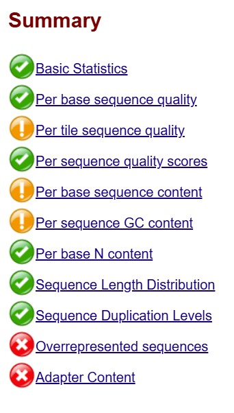

### Adapter Content Tab

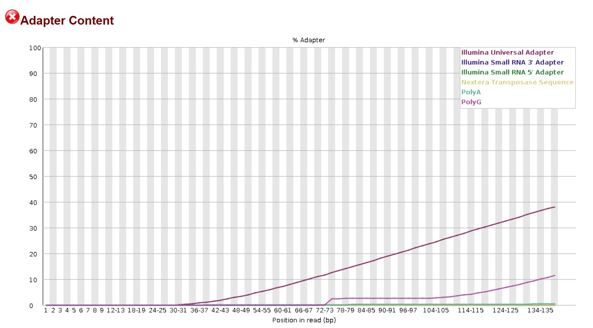

</details>

---

<details>
<summary><strong>Pp371_2.fq.gz (Raw Reverse Reads)</strong></summary>

```
Pp371_2.fq.gz
```

**Warning (Orange) Flags**
- Per tile sequence quality  
- Per sequence GC content  
- Overrepresented sequences  

**Error (Red) Flags**
- Per base sequence content  
- Adapter Content  

### Summary Tab

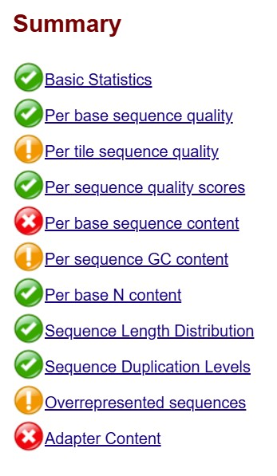

### Adapter Content Tab

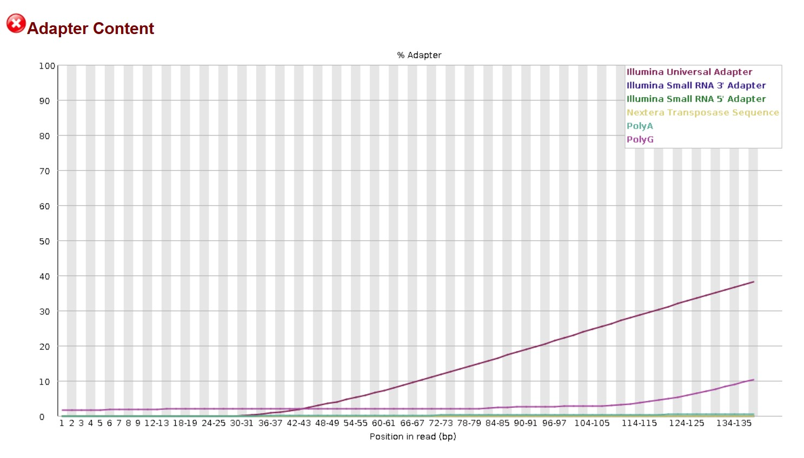

</details>

---

## Sequence Trimming

Reads were trimmed using Trimmomatic in paired-end mode.

```
java -jar trimmomatic.jar PE
-phred33
Pp371_1.fq.gz Pp371_2.fq.gz
Pp371_1_paired.fastq Pp371_1_unpaired.fastq
Pp371_2_paired.fastq Pp371_2_unpaired.fastq
ILLUMINACLIP:adaptors.fa:2:30:10
SLIDINGWINDOW:20:20 MINLEN:125
```

---

## Post-Trim Quality Assessment

Trimmed paired and unpaired reads were reassessed using FastQC. All warning (orange) and error (red) flags are summarized below.

---

<details>
<summary><strong>Pp371_1_paired.fastq (Trimmed Forward Paired Reads)</strong></summary>

```
Pp371_1_paired.fastq
```

**Warning (Orange) Flags**
- Per tile sequence quality  
- Per sequence GC content  
- Sequence Length Distribution  

**Error (Red) Flags**
- None  

### Summary Tab

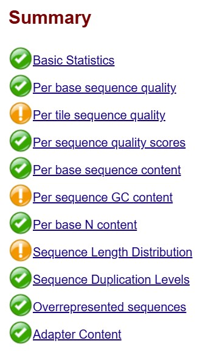

### Adapter Content Tab

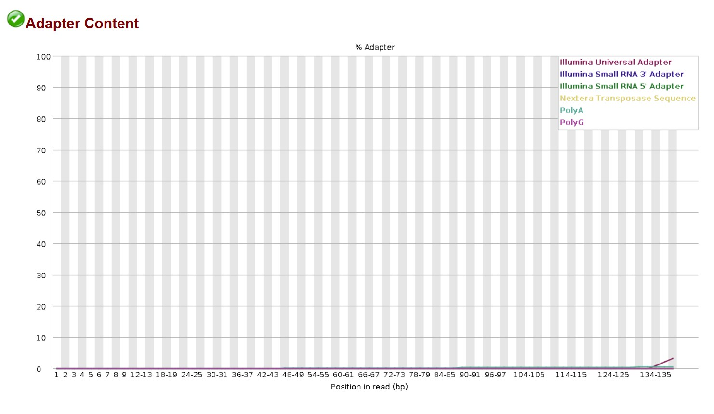

</details>

---

<details>
<summary><strong>Pp371_2_paired.fastq (Trimmed Reverse Paired Reads)</strong></summary>

```
Pp371_2_paired.fastq
```

**Warning (Orange) Flags**
- Per tile sequence quality  
- Per sequence GC content  
- Sequence Length Distribution  
- Adapter Content  

**Error (Red) Flags**
- None  

### Summary Tab

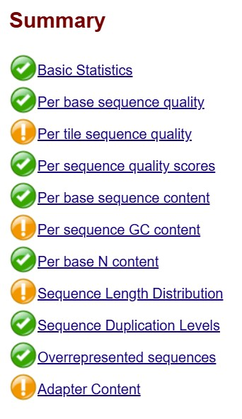

### Adapter Content Tab

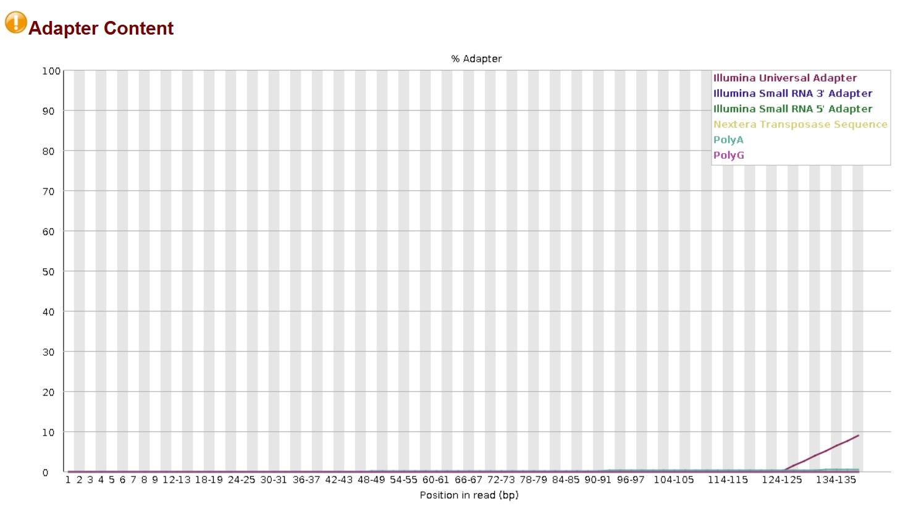

</details>

---

<details>
<summary><strong>Pp371_1_unpaired.fastq (Trimmed Forward Unpaired Reads)</strong></summary>

```
Pp371_1_unpaired.fastq
```

**Warning (Orange) Flags**
- Per tile sequence quality  
- Per sequence GC content  
- Sequence Length Distribution  

**Error (Red) Flags**
- None  

### Summary Tab

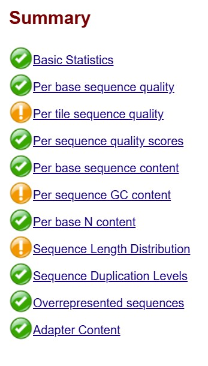

### Adapter Content Tab

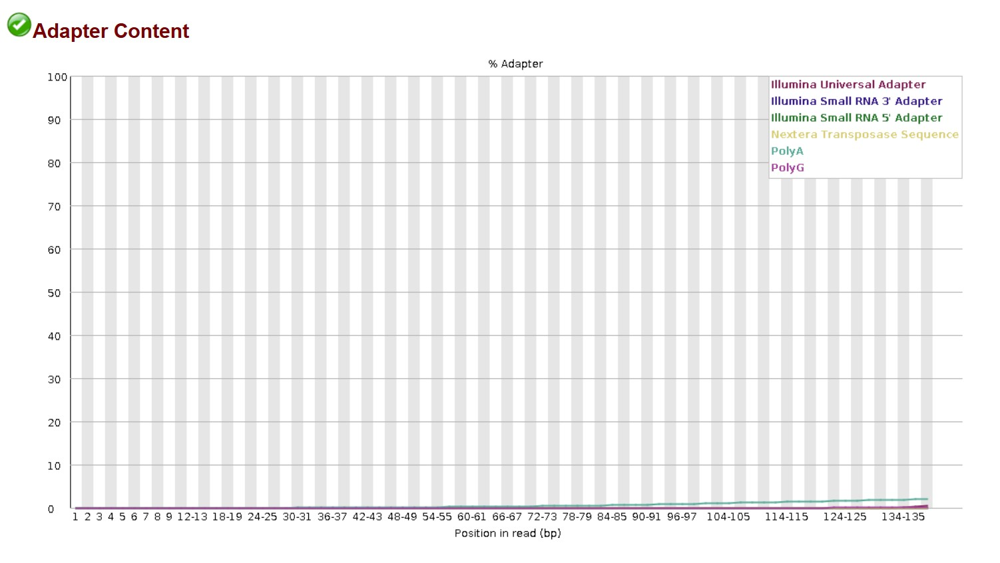

</details>

---

<details>
<summary><strong>Pp371_2_unpaired.fastq (Trimmed Reverse Unpaired Reads)</strong></summary>

```
Pp371_2_unpaired.fastq
```

**Warning (Orange) Flags**
- Per tile sequence quality  
- Per sequence GC content  
- Sequence Length Distribution  

**Error (Red) Flags**
- Per base sequence content  
- Adapter Content  

### Summary Tab

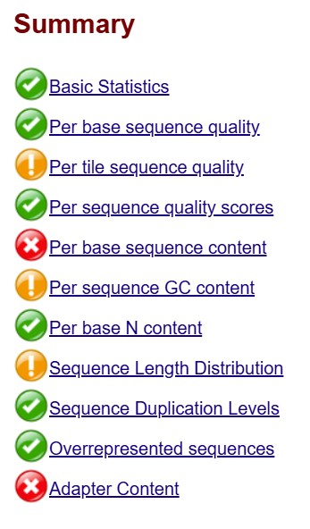

### Adapter Content Tab

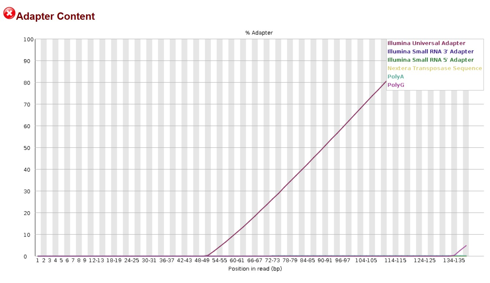

</details>

---

## Genome Assembly Strategy

Genome assembly was performed using both Velvet and SPAdes to compare performance and optimize contiguity.

---

## K-mer Selection and Optimization

A suitable k-mer length was estimated using Velvet Advisor and refined through iterative optimization.

```
velvetoptimiser -s <low_k> -e <high_k> -x 10
-d Pp371_assembly
-f '-shortPaired -fastq.gz -separate
Pp371_1_paired.fastq.gz Pp371_2_paired.fastq.gz'
-t 12
```

---

## Velvet Assembly (Round 1)

```
sbatch velvetoptimiser.sh Pp371 <low_k> <high_k> 10
```

---

## Velvet Assembly (Round 2 Optimization)

A second optimization round was performed using a narrower k-mer range centered around the optimal value.

---

## SPAdes Assembly

```
sbatch spades.sh . Pp371
```

---

## Assembly Metrics Comparison

### N50 Calculation

```
#!/bin/bash
grep -v ">" scaffolds.fasta | awk '{print length($0)}' | sort -nr > lengths.txt

total=$(awk '{sum+=$1} END {print sum}' lengths.txt)
half=$(echo "$total / 2" | bc)

cumsum=0
while read len; do
cumsum=$((cumsum + len))
if [ $cumsum -ge $half ]; then
echo "N50: $len"
break
fi
done < lengths.txt
```

---

## Assembly Graph Visualization (Bandage)


---

## Directory Structure

```
Pp371/
├── data/
├── code/
├── images/
└── results/
```

---

## Gene Prediction Strategy

Gene prediction was performed using multiple complementary approaches to improve accuracy and completeness.

---

## Gene Prediction with SNAP

```
snap-hmm Moryzae.hmm Pp371.fasta > Pp371-snap.zff

snap-hmm Moryzae.hmm Pp371.fasta -gff > Pp371-snap.gff2
```

---

## Gene Prediction with AUGUSTUS

```
augustus --species=magnaporthe_grisea --gff3=on
--singlestrand=true --progress=true
Pp371ID_final.fasta > Pp371ID-augustus.gff3
```

---

## Genome Annotation with MAKER

```
singularity exec /share/singularity/images/ccs/MAKER/amd-maker-debian10.sinf maker -CTL

sbatch maker.sh path/to/Pp371ID_final.fasta

gff3_merge -d Pp371ID_final.maker.output/Pp371ID_final_master_datastore_index.log
-o Pp371ID-maker.gff3
```

---

## IGV Visualization


---

## Final Notes

This repository documents a full genome analysis workflow from raw sequencing reads through genome assembly, gene prediction, and visualization.
